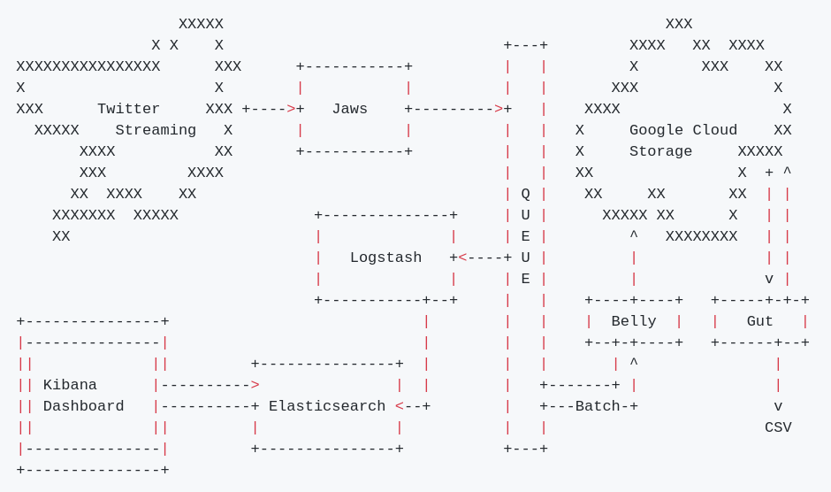
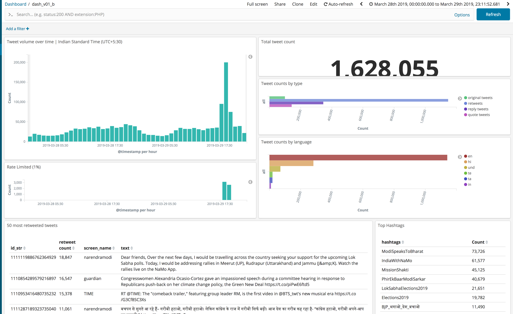

## Motivation

Researchers from the Reuters institute asked us to collect Tweets regarding the Indian election.

They would provide a set of users and hashtags they would like to follow and they wanted collection to run during the 5-week-long Indian election.

{height=50px}

## Problem

We needed to collect streaming tweets and store them somewhere reasonable.

Suprisingly, there is not an off-the-shelf open source tool for doing this.

So we built one.

## Challenges

1. Should work with free tier of Twitter streaming (no redundancy allowed implies a single point of failure).
2. Highest possible uptime despite that single point of failure.
3. Highly durable storage layer required.

And: it should be fully reusable!

## Architecture

{height=350px}

## Jaws

Jaws is our application that actually connects to the Twitter streaming API and recieves tweets.

By design, this is our single point of failure when on the free tier (Twitter doesn't allow multiple connections). Thus, it needs to be rock solid.

## Jaws + Clojure

It is written in Clojure and built to use Twitter's own Hosebird (Java) library.

Hosebird puts tweets on an in-memory queue. Jaws uses Clojure's go loops to create a high number of lightweight asynchronous workers on a moderately-sized thread pool. The workers read from the queue and write to our Durable Queue.

## Stress Testing

3 weeks spent testing Jaws on Twitters hottest topics.

Memory profiled to ensure no memory leaks under heavy load and tuned to have a small, constant memory footprint (VisualVM, G1GC vs. Parallel)

CPU usage also optimized (go loops!) to keep CPU usage down under load.

All of this also ensures that the project is usable for larger loads!

## Durable Queue

Used Google Cloud Pub/Sub for a completed hosted solution.

In theory, this should be the most reliable option.

In practise, our only major downtime was due to an outage in the Pub/Sub service.

In the future, maybe just use Kafka?

## Dashboard

{height=350px}

## ELK

Kibana dashboard built on ELK stack: Elasticsearch, Logstash, Kibana.

Kibana + Elasticsearch combo makes it very easy to:

1. Write fully custom, complex queries that are performant over millions of tweets.
2. Tweets kept in JSON form, (few) decisions made as to what is needed.
3. Easily add new widgets to the dashboard.
4. Drill down and use for diagnostics, see problems.

## Logstash

Logstash loads tweets in realtime from queue into Elasticsearch.

Custom logstash filter (Ruby) to prepare tweet (extended tweet, retweet, etc.)

Fast and solid.

## Belly + Cloud Storage

Belly is a super simple service, reads a batch from the queue, writes it in original format to Cloud Storage (JSON), acks the messages when everything is written.

File storage, in this case Cloud Storage, is highly durable and scales infinitely.

No reason for JSON in the future (Parquet/Avro).

## Gut

Simple Python framework to perform computations and summary statistics on tweet warehouse.

Consists of two parts:

1. Reads tweets from storage, deduplicates, writes to temp Redis (ArDB).
2. Performs aggregations across entire tweet corpus and outputs CSV's (engagement counts, network edges between users if shared mention)

## Kubernetes + Helm

Kubernets is used to handle container orchestration. In practise this gives us:

1. One place to capture errors, metrics, send alerts on downtime (Google's Stackdriver).
2. Supervisor to restart containers and run containers multi-availability-zone (3-zone cluster)
3. Helm allows us to package the app for single-command deploy and puts all configuration in one place. Helps make this feasible as open source project!

## Open Source!

https://github.com/agriuseatstweets

## Summary

Open Source framework for collected streaming Tweets: [github.com/agriuseatstweets](https://github.com/agriuseatstweets). Instant deploy with Kubernetes/Helm to multi-zone cluster. Highly durable file storage. Optimized for high throughput (Hosebird + Clojure, PubSub). Live, flexible dashboarding framework provided by Elasticsearch/Kibana.

{height=115px}\     {height=115px}
